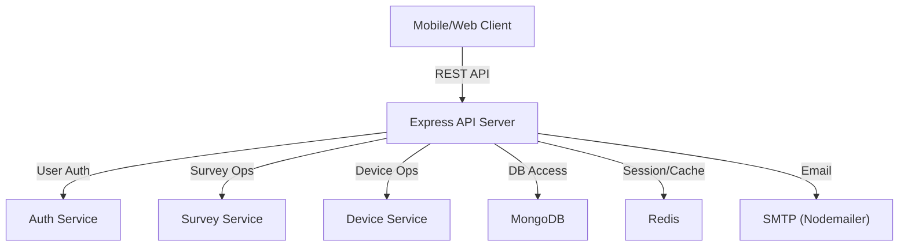

# Survey Backend API

A robust, secure, and scalable RESTful API server for a Survey Mobile App, designed for offline-first survey data collection and management. Built with Node.js, Express, TypeScript, Prisma, and MongoDB, it supports user authentication, device management, survey submission, analytics, and more.

---

## Table of Contents

- [Features](#features)
- [Tech Stack](#tech-stack)
- [Architecture Overview](#architecture-overview)
- [Database Models](#database-models)
- [API Endpoints](#api-endpoints)
- [Setup & Installation](#setup--installation)
- [Environment Variables](#environment-variables)
- [Scripts](#scripts)
- [Security](#security)
- [License](#license)

---

## Features

- **User Authentication**: JWT-based login, refresh, logout, password reset, and role-based access (SUPER_ADMIN, ADMIN, VIEWER).
- **Device Management**: Register, update, delete, and configure survey devices.
- **Survey Management**: Submit, fetch, export, and analyze survey responses.
- **Analytics & Statistics**: Real-time feed, summary, and analytics endpoints.
- **Rate Limiting & Security**: Helmet, CORS, rate limiting, and sanitization.
- **Admin Tools**: Bulk operations, audit logs, and admin user management.
- **Offline-First**: Designed for mobile clients with intermittent connectivity.
- **Export**: Surveys can be exported as CSV or JSON.
- **Monitoring & Logging**: Winston logger, Sentry integration (optional), and health checks.

---

## Tech Stack

- **Node.js** + **Express** (API server)
- **TypeScript** (type safety)
- **Prisma** (MongoDB ORM)
- **MongoDB** (database)
- **Redis** (sessions, caching)
- **JWT** (authentication)
- **Joi** (validation)
- **Winston** (logging)
- **Docker** (containerization)

---

## Architecture Overview



---

## Database Models

- **User**: email, name, password, role, permissions, organization, isActive, lastLogin, etc.
- **Session**: userId, sessionToken, refreshToken, deviceInfo, ipAddress, userAgent, isActive, expiresAt.
- **Device**: deviceId, location, name, status, configuration, lastSeen.
- **Survey**: deviceId, location, answer (EXCELLENT/GOOD/POOR), timestamp, deviceInfo, syncStatus.
- **AuditLog**: userId, action, resource, details, timestamp.

(See `prisma/schema.prisma` for full details.)

---

## API Endpoints

### Auth

- `POST /api/v1/auth/login` — Login user
- `POST /api/v1/auth/refresh` — Refresh access token
- `POST /api/v1/auth/logout` — Logout user
- `POST /api/v1/auth/logout-all` — Logout from all devices
- `GET /api/v1/auth/me` — Get current user profile
- `PUT /api/v1/auth/profile` — Update user profile
- `POST /api/v1/auth/forgot-password` — Request password reset
- `POST /api/v1/auth/reset-password` — Reset password with token
- `POST /api/v1/auth/change-password` — Change password
- `GET /api/v1/auth/verify` — Verify token validity

### Surveys

- `POST /api/v1/surveys/submit` — Submit survey response
- `GET /api/v1/surveys/stats` — Get survey statistics
- `GET /api/v1/surveys` — Get surveys (paginated)
- `GET /api/v1/surveys/location/:locationId` — Get surveys by location
- `GET /api/v1/surveys/export` — Export surveys (CSV/JSON)
- `GET /api/v1/surveys/analytics` — Get analytics
- `GET /api/v1/surveys/feed` — Real-time survey feed
- `GET /api/v1/surveys/summary` — Survey summary for date range
- `DELETE /api/v1/surveys/cleanup` — Cleanup old surveys (admin)
- `PUT /api/v1/surveys/bulk-sync` — Bulk update sync status

### Devices

- `POST /api/v1/devices/register` — Register new device
- `GET /api/v1/devices` — Get devices (paginated)
- `GET /api/v1/devices/stats` — Device statistics
- `GET /api/v1/devices/:id` — Get device by ID
- `PUT /api/v1/devices/:id` — Update device
- `DELETE /api/v1/devices/:id` — Delete device (admin)
- `GET /api/v1/devices/:id/config` — Get device config
- `PUT /api/v1/devices/:id/config` — Update device config
- `GET /api/v1/devices/:id/status` — Get device status
- `POST /api/v1/devices/:id/ping` — Ping device (update last seen)
- `GET /api/v1/devices/location/:location` — Get devices by location
- `PUT /api/v1/devices/bulk-status` — Bulk update device status

### Misc

- `GET /health` — Health check
- `GET /api/v1/docs` — API documentation

---

## Setup & Installation

### Prerequisites

- Node.js (>= 18.x)
- MongoDB
- Redis
- (Optional) Docker

### 1. Clone the repository

```bash
git clone <repo-url>
cd survey-backend-api
```

### 2. Install dependencies

```bash
npm install
```

### 3. Configure environment variables

Copy `.env.example` to `.env` and fill in your values:

```bash
cp env.example .env
```

### 4. Setup the database

```bash
npx prisma generate
npx prisma db push
```

### 5. Start the server

For development:

```bash
npm run dev
```

For production:

```bash
npm run build
npm start
```

Or use Docker:

```bash
docker-compose up --build
```

---

## Environment Variables

See `.env.example` for all required variables, including:

- `NODE_ENV`, `PORT`, `API_VERSION`
- `DATABASE_URL`
- `JWT_SECRET`, `JWT_REFRESH_SECRET`
- `REDIS_URL`
- `SMTP_HOST`, `SMTP_USER`, etc.
- `ALLOWED_ORIGINS`
- `RATE_LIMIT_WINDOW_MS`, `RATE_LIMIT_MAX_REQUESTS`
- `ADMIN_EMAIL`, `ADMIN_PASSWORD`
- and more...

---

## Scripts

- `npm run dev` — Start in development mode (with hot reload)
- `npm run build` — Compile TypeScript
- `npm start` — Start compiled server
- `npm run prisma:studio` — Open Prisma Studio
- `npm run prisma:migrate` — Run DB migrations
- `npm run lint` — Lint code
- `npm run lint:fix` — Auto-fix lint issues

---

## Security

- **Helmet** for HTTP headers
- **CORS** with configurable origins
- **Rate limiting** to prevent abuse
- **MongoDB injection sanitization**
- **JWT** for authentication
- **Password hashing** with bcrypt
- **Role-based access control**

---

## License

MIT
